# Cypress-automation framework formation
## Prerequisite
1. Assume working on windows
2. Install [node.js](https://nodejs.org/en/download/current)
3. Install [git and git bash](https://gitforwindows.org/)
4. Install [VS code](https://code.visualstudio.com/download)
5. git, npm knowledges

## Setup dev environment
1. Create Cypress-automation-framework folder
2. Open VS code on this folder
3. Open git bash terminal on VS code<br/>
   - run `npm init`
      - follow the steps and initialize the fields as you want. For instance:<br/>
```
{
  "name": "cypress-automation-framework",
  "version": "1.0.0",
  "description": "Cypress Automation Framework",
  "main": "index.js",
  "scripts": {
    "test": "echo \"Error: no test specified\" && exit 1"
  },
  "author": "Nicolas Parisse",
  "license": "ISC"
}
```
4. Install cypress: `npm install --save-dev cypress@12.14.0`
5. Create .gitignore file and remove node_modules
6. Open cypress for the first time through git bash: `./node_modules/.bin/cypress open`
7. Select E2E Testing<br/>
8. Choose Chrome browser<br/>
9. Select Scaffold example specs<br/><br/>cypress folder must be generated in your cypress-automation-framework folder<br/>
10. Open cypress again and here are the sample tests!<br/>

## Mocha Overview

Mocha comes with two function `describe()` and `it()`. It uses those function to regroup the tests.
<br/>`describe()` takes two arguments: the name of the test and the function to apply the test. It is basically used to regroup the test.
<br/>`it()` function must define each individual test inside the describe block and also take two argument: the name of the this individual test should do and the function with all the action to perform it.

### Mocha exemple


## Usefull Extension
### ES6 Mocha Snippets
<br/>This extension will fasten your code writting with usefull autocomplete feature:<br/>

### Material Icon Theme
<br/>Just to get wonderfull icons like below:<br/>

## Web elements and selectors

### Selectors from cypress
You can get et selector directly from cypress after running a test:
1. Select a step in step body to display the iframe window you are testing
2. Click on the target icon
3. Click on the inspect icon
4. Select the expected element in the iframe window
5. Get the selector<br/>

### Selectors from chrome
Chrome dev tools has a feature in itself which propose to get css selectors of elements from the html file.
1. Open dev tools (press F12 on chrome tab)
2. Select elements tab
3. Click on the inspect icon
4. Select the expected element
5. Right-click on the expected element > copy > css selector<br/>

### Best practice
It is way recommended to create a specific attribute on the elements during the development. For instance `data-cy`. It will avoid any issue when a feature changes the css elements or its position in the html page.
You can check this [topic](https://docs.cypress.io/guides/references/best-practices#Selecting-Elements) to be convinced.<br/>

### Usefull chrome extension
[Ranorex Selocity](https://chromewebstore.google.com/detail/ranorex-selocity/ocgghcnnjekfpbmafindjmijdpopafoe) can be usefull to find the simpliest css selector. It can also be used to find element through xpath.<br/><br/>
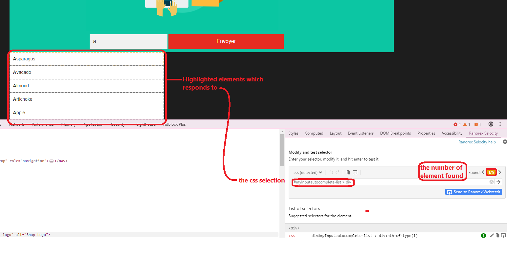

## Assertions

### Overview
The assertions on Cypress are handled through the chai library.<br/>
Chai has several interfaces that allow the developer to choose the most comfortable. The chain-capable BDD styles provide an expressive language & readable style, while the TDD assert style provides a more classical feel.<br/>
<br/>
You can visit the [chai website](https://www.chaijs.com/) for more details.

### Valid assertion


### Invalid assertion
In case of invalid assertion, cypress presents the reason why it did not workd and also point out specifically where the invalid assertion is located in the code.<br/>


## Execute all tests in terminal
1. Go to your git bash terminal
2. Run this command: `./node_modules/.bin/cypress run`
   - the tests start to run:<br/><br/>This window provides the configuration of the test environment such as the web browser where the tests are running, the cypress version, etc...
   - the test result for one test:<br/>
   - the tests end:<br/>
<br/><br/>The above command executes the tests headlessly, you won't see them running. You can modify this behaviour by adding the `--headed` option: `./node_modules/.bin/cypress run --headed`<br/>
All the options available are listed on cypress website documentation [here](https://docs.cypress.io/guides/guides/command-line#Options)

## Cypress Asynchronous framework

Cypress framework is asynchone. So when some script instruction are added in a test while not being from the cy framework it leads to some unexpected behaviour.
For instance in the below code:<br/>
```
describe("Test Contact Us form via Automation Test Store", () => {
    it.only("Should be able to submit a successful submission via contact us form", () => {
        cy.visit("https://automationteststore.com/"); 
        cy.xpath('//a[contains(@href, "contact") and starts-with(text(), "Con")]').click();
        cy.get('#ContactUsFrm_first_name').type("Jean");
        cy.get('#ContactUsFrm_email').type("Jean.Valjean@email.com");
        cy.get('#ContactUsFrm_email').should('have.attr', 'name', 'email')
        cy.get('#ContactUsFrm_enquiry').type("Do you provide international shipping?");
        cy.get('button[title="Submit"]').click();
        cy.get('.mb40 > :nth-child(3)').should('have.text', "Your enquiry has been successfully sent to the store owner!")
        console.log("Test has been completed!")
    })
})
```
The console.log instruction will most likely happen before all the cy instructions.

### Cypress logs
As Console.log can't be used, you must use Cypress log command:<br/>
`cy.log("Test has been completed!")`

### Promises
It is actually possible to handle non cypress command by using promises:<br/>
```
describe('Inspect Automation Test Store items using chain of commands', () => {
    it('Click on the first item using item text', () => {
        cy.visit("https://automationteststore.com/")
        cy.get('.prdocutname').contains('Skinsheen Bronzer Stick').click().then(function(itemHeaderText){
            console.log('Selected the following item: ' + itemHeaderText.text())
        })
    })
})
```
In the above code sample, the console.log command is handled correctly as it is inserted in the callback function of then method.

## Variables, commands and promises
### Bad practice
Variables should never used to perform cy commands as the order of action can't be certain. 
Instance of a bad practice:
```
const makeupLink = cy.get("a[href*='product/category&path=']").contains('Makeup')
const skincareLink = cy.get("a[href*='product/category&path=']").contains('Skincare')
skincareLink.click()
makeupLink.click()
```

### Good practice
A variable should not be used to perform cy commands, when it is used it should only to get information. It must also be used through a promise to ensure the element is still accessible.
For instance:
```
cy.get('h1 .maintext').then(($headerText) => {
            const headerText = $headerText.text()
            cy.log("Found header text: " + headerText)
            expect(headerText).is.eq('Makeup')
        })
```

## Invoke and Aliases

### Invoke
Invoke cypress method will invoke the JQuery method given as parameter:
`cy.get('.modal').invoke('show')`

### Aliases
BeforeEach function in cypress is performed before any individual test inside a describe function. In this BeforeEach function, you can define aliases which will then be accessible in each individual tests:

```
beforeEach(() => {
    cy.visit("https://automationteststore.com/")
    cy.get("a[href*='product/category&path=']").contains('Hair Care').click()
    cy.get("#grid").click()
    cy.get(".thumbnails.grid .thumbnail").as("productThumbnailGrid")
})

it('Validate product thumbnail count', () => {
    cy.get('@productThumbnailGrid').should('have.length', 4)
})
```

> Aliases are not necessarly inserted in BeforeEach function.

## Security restriction
Cypress prevent access to a page from a different domain in a single test. it is not possible to visit site of different domains.
For instance, both test codes won't work:
```
describe("Cypress web security", () => {
    it("Validate visiting two different domains", () => {
        cy.visit("https://www.webdriveruniversity.com/")
        cy.visit("https://automationteststore.com/")
    });

    it.only("validate visiting two different domains via user action", () => {
        cy.visit("https://www.webdriveruniversity.com/")
        cy.get("#automation-test-store").invoke("removeAttr", "target").click() // click on a button which redirect to https://automationteststore.com/
        cy.contains('#ContactUsFrm', 'Contact Us Form').find('#field_11').should('contain', 'First name')
    });
})
```

## Browser navigation
### Prevent multiple tabs
To prevent a button opening a new tab when clicking on it:
```cy.get("#contact-us").invoke('removeAttr', 'target').click()```

### Go back to previous
When a button direct to a new page, we might want to go back to the previous page as would do the previous button of the browser:
```cy.go('back')```
### Go forward
```cy.go('forward')```
### Reload
reload with cache: `cy.reload()`
reload without cache: `cy.reload(true)`

## Handling event
For further details upon events see the Cypress documentation is [here](https://docs.cypress.io/api/cypress-api/catalog-of-events#Event-Types).

### Js Alert box 
Cypress automatically accept alert event. It still possible to handle them.
For instance, we can assert it contains a certain string:
```
cy.on('window:alert', (str) => {
    expect(str).to.equal('I am an alert box!')
})
```

### Js Confirm box
```
it("Validate Js confirm box works when clicking cancel", () => {
    cy.visit("https://www.webdriveruniversity.com")
    cy.get("#popup-alerts").invoke('removeAttr', 'target').click()
    
    cy.get("#button4").click()

    cy.on('window:confirm', (str) => {
        return false; // Cancel the confirm box
    })

    cy.get("#confirm-alert-text").contains('You pressed Cancel!')
});
```
The Cypress log would result as below:<br/>

## How to handle iframe
By default, Cypress does not handle iframes.
For instance, you can't select any element in an iframe from Cypress window:<br/><br/>
Cypress would only provide you the access to the iframe element.

In order to bypass this, it is possible to use a promise to handle the content of the iframe, grab the body of the iframe and wrap it in the cy.wrap method to perform cy press commands on it:
```
cy.get('#frame').then($iframe => {
    const body = $iframe.contents().find('body')
    cy.wrap(body).as('iframe')
})
```
This bypass will work as Cypress will then be able to use the iframe's body as a usual html element. Still, the snapshot won't display the content of the iframe while performing action on it. So when a test fail on an iframe it can't be handled easily.
<br/>Below, the 'blank' image while the test still passed:<br/><br/>
> the issue can be found on github [here](https://github.com/cypress-io/cypress/issues/136) and seem not to be taken seriously by Cypress.

## Checkboxes and radiobutton
### Check one or first
```
cy.get('[type="checkbox"]').check() // Check checkbox element
cy.get('[type="radio"]').first().check() // Check first radio element
```
### Check multiple and specific ones from value
below checkboxes:
```
<form>
  <input type="checkbox" id="subscribe" value="subscribe" />
  <label for="subscribe">Subscribe to newsletter?</label>
  <input type="checkbox" id="acceptTerms" value="accept" />
  <label for="acceptTerms">Accept terms and conditions.</label>
</form>
```

Can be checked by value as below:
```
cy.get('form input').check(['subscribe', 'accept'])
```
### Check radiobutton is disabled
```
cy.get('#radio-buttons-selected-disabled input[type="radio"][value="cabbage"]').should('be.disabled')
```

## DropdownList
They can be selected through their value or their visible content through the same method.
Let take this html element for instance:
```
<select class="dropdown-menu-lists" id="dropdowm-menu-1">
    <option value="java">JAVA</option>
    <option value="c#">C#</option>
    <option value="valuepython">Python</option>
    <option value="sql">SQL</option>
</select>
```
### By value
```
cy.get('#dropdowm-menu-1').select('valuepython')
```
### By visible text
```
cy.get('#dropdowm-menu-1').select('Python')
```
### Assert an option is selected
```
cy.get('#dropdowm-menu-2').select('java').should('have.value', 'testng')
```

## Autocomplete dropdownlist
### preview
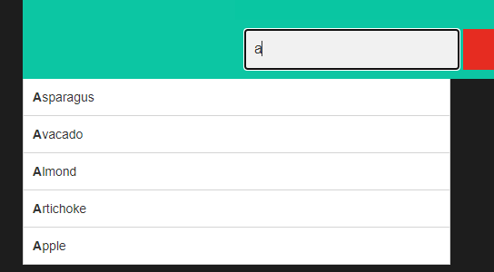<br/>
### objective
- insert *a* in the field
- select *Avacado*

### cypress individual test code sample
```
it('selects the Avacado option', () => {
    cy.get('#myInput').type('A')
    cy.get('#myInputautocomplete-list > div').each(($el) => {
        if($el.text() === 'Avacado') {
            cy.wrap($el).click() // or use directly jquery => $el.trigger('click') 
        }
    })
    cy.get('#submit-button').click()
});
``` 

## Mouse actions
the cypress documentation on mouse events is [here](https://docs.cypress.io/api/commands/trigger#Mouse-Events)
### scrolling to get the element into the viewport
```
cy.get('#actions').scrollIntoView()
```
### click, double click
```
cy.get('#idElement').dblclick()
cy.get('#idElement').click()
```

### elements displayed only according to css pseudo-class
Sometimes, an element switches from `display: none` to `display: block` only according to css pseudo class of another element.
For instance:<br/>
html:<br/>
```
<div class=toBeHovered>
    <div class=hiddenByDefault>
        Hello !
    </div>
</div>
```
css:<br/>
```
.hiddenByDefault {
    display: none;
}

toBeHovered:hover .hiddenByDefault {
    display: block;
}
```

In this case, the usual `cy.trigger('mouseover')` won't work as it is not a real mouseover but a trigger of the js *mouseover* event.<br/>Thanks to [*Chrome Devtools Protocol*](https://chromedevtools.github.io/devtools-protocol/) you can fix it for any _chromium-based browser_ by installing a cypress plugin:<br/>
```
npm install cypress-real-events
```
> it won't work for firefox test !

Then import it on the e2e.js file:<br/>
```
import "cypress-real-events";
```
this feature should be used the less possible as not a built-in cypress solution, there won't be snashots on the cypress UI. In the image below you can see the assertion is validated while the snapshot does not display the element:<br/>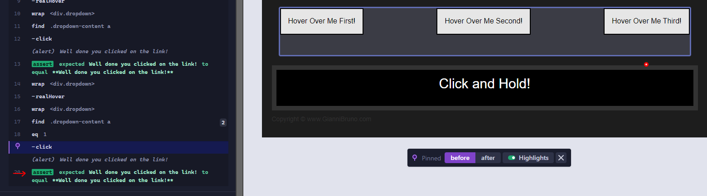
<br/>
<br/>
Another workaround is to force the action even if the element is hidden: 
```
cy.get(HiddenElement).click({force:true})
```

## Elements traversal
it is possible to traverse the DOM elements:
- [children()](https://docs.cypress.io/api/commands/children#Selector)
- [closest()](https://docs.cypress.io/api/commands/closest#Find-the-closest-element-of-the-error-with-the-class-banner)
- [eq()](https://docs.cypress.io/api/commands/eq#Make-an-assertion-on-the-3rd-row-of-a-table)
- [filter()](https://docs.cypress.io/api/commands/filter#Filter-by-text)
- [find()](https://docs.cypress.io/api/commands/find#Get-lis-within-parent)
- [first()](https://docs.cypress.io/api/commands/first#Get-the-first-list-item-in-a-list)
- [last()](https://docs.cypress.io/api/commands/last#Get-the-last-list-item-in-a-list)
- [nextAll()](https://docs.cypress.io/api/commands/nextAll#Find-all-of-the-elements-siblings-following-second)
- [nextUntil()](https://docs.cypress.io/api/commands/nextUntil#Find-all-of-the-elements-siblings-following-veggies-until-nuts)
- [not()](https://docs.cypress.io/api/commands/not#Yield-the-elements-that-do-not-have-class-active)
- [parent()](https://docs.cypress.io/api/commands/parent#Get-the-parent-with-class-sub-nav-of-all-li-elements)
- [parents()](https://docs.cypress.io/api/commands/parents#Get-the-parents-of-the-active-li)
- [prev()](https://docs.cypress.io/api/commands/prev#Find-the-previous-element-of-the-element-with-class-of-active)
- [prevAll()](https://docs.cypress.io/api/commands/prevAll#Find-all-of-the-elements-siblings-before-third)
- [prevUntil()](https://docs.cypress.io/api/commands/prevUntil#Find-all-of-the-elements-siblings-before-nuts-until-veggies)
- [siblings()](https://docs.cypress.io/api/commands/siblings#Get-the-siblings-of-each-li)

## Asynchronous drawback
As Cypress is asynchronous, loops must be prohibited as any cypress command inside might not be executed in the expected order.

### Loop does not work
```
function goToYearsPanel() {
    goToMonthsPanel()
    cy.get('@monthsPanelHeader').click()
    cy.get('@yearsPanel').should('be.visible').then(() => {                
       do 
        {
            IsCorrectYearPanel = true
            cy.get('@yearsPanel').first().then($year => {
                if(futureYear < Number($year.text()))
                {
                    cy.log("Selecting previous years panel: first year " + $year.text() + " > " + futureYear)
                    IsCorrectYearPanel = false
                    selectPreviousYearsPanel()
                }
            })
            
            cy.get('@yearsPanel').last().then($year => {
                if(futureYear > Number($year.text()))
                {
                    cy.log("Selecting next years panel: last year " + $year.text() + " < " + futureYear)
                    IsCorrectYearPanel = false
                    selectNextYearsPanel()
                }
            })
        } while (!IsCorrectYearPanel);                 
    })
}
```
The above code won't work as expected. IsCorrectYearPanel would be check true and so go out of the loop before it is set false in one of the `then()` promise.

### Best practice
The use of recursive functions must be chosen instead:
```
function goToYearsPanel() {
    goToMonthsPanel()
    cy.get('@monthsPanelHeader').click()
    cy.get('@yearsPanel').should('be.visible').then(() => {                
        BrowseToCorrectYearsPanel()                
    })
}

function BrowseToCorrectYearsPanel()
{
    cy.get('@yearsPanel').first().then($year => {
        if(futureYear < Number($year.text()))
        {
            cy.log("Selecting previous years panel: first year " + $year.text() + " > " + futureYear)
            selectPreviousYearsPanel()
            BrowseToCorrectYearsPanel()
        }
    })
    
    cy.get('@yearsPanel').last().then($year => {
        if(futureYear > Number($year.text()))
        {
            cy.log("Selecting next years panel: last year " + $year.text() + " < " + futureYear)
            selectNextYearsPanel()
            BrowseToCorrectYearsPanel()
        }
    })
}
```

## Upload a file
### Display of an upload component
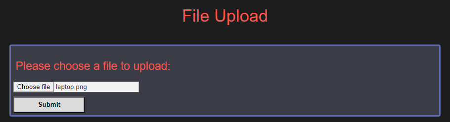<br/>

### Html description
```
<form>
    <h2>Please choose a file to upload:</h2>
    <input type="file" id="myFile" name="filename">
    <input type="submit" id="submit-button" onclick="fileSubmitted()">
</form>
```

### Test uploading the file
```
it("uploads a file", () => {
    cy.get("#myFile").selectFile('cypress/fixtures/laptop.png')
    cy.get("#submit-button").click()    
    
    //modify the alert event triggered on upload to validate the upload
    cy.on('window:alert', (str) => {
        expect(str).to.equal('Your file has now been uploaded!')
    })
});
```

### Test result
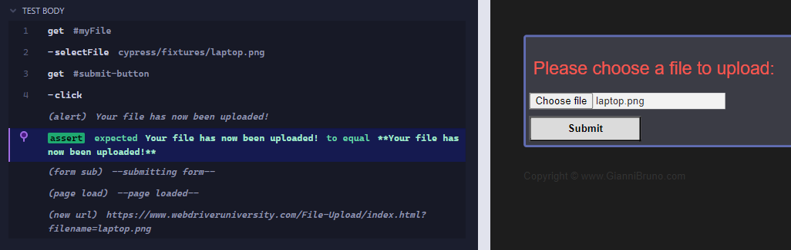

### Test structures through hooks
- before(): runs once before all tests in the block
- beforeEach(): runs before each test in the block
- afterEach(): runs after each test in the block
- after(): runs once after all tests in the block

### Instance
In the below cypress *hooks* test, two individual tests are running with all above hooks defined with some logs:
```
describe('hooks', () => {
    before(() => {
        cy.log('runs once before all tests in the block')
    });

    after(() => {
        cy.log('runs once after all tests in the block')
    });

    beforeEach(() => {
        cy.log('runs before each test in the block')
    });

    afterEach(() => {
        cy.log('runs after each test in the block')
    });

    it('Exemple test 1', () => {
        cy.log('Exemple test 1')
    });

    it('Exemple test 2', () => {
        cy.log('Exemple test 2')
    });
});
```

It results as expected in the cypress log panel:<br/>
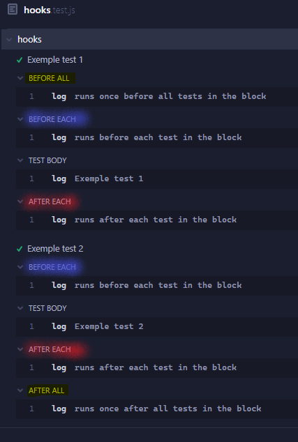

## Fixtures
Cypress can play with external data through the `fixtures()` method. This can be used to split the test process and the data which drives the test.
For instance, when testing the submission of a form with multiple input from the user. It is better to split the user inputs to the process consisting in typing all the inputs and submit the form.

### Test without fixtures
```
it("Should be able to submit a successful submission via contact us form", () => {
    cy.get('[name="first_name"]').type("Jean")
    cy.get('[name="last_name"]').type("Valjean")
    cy.get('[name="email"]').type("Jean.Valjean@email.com")
    cy.get('textarea.feedback-input').type("I am a character from Les Miserables")
    
    cy.get('[type="submit"]').click()

    cy.get('h1').should('have.text','Thank You for your Message!')
});
```
### Test with fixtures
Let create a file in cypress/fixtures folder called example.json:
```
{
  "name": "Jean",
  "last_name": "Valjean",
  "email": "Jean.Valjean@email.com",
  "description": "I am a character from Les Miserables"
}
```
#### reference the file in the test
```
before(() => {
    cy.fixture('example').then(function(data){
        globalThis.data = data
    })
});
```

#### use the data
```
it("Should be able to submit a successful submission via contact us form", () => {
    cy.get('[name="first_name"]').type(data.name)
    cy.get('[name="last_name"]').type(data.last_name)
    cy.get('[name="email"]').type(data.email)
    cy.get('textarea.feedback-input').type(data.description)
    cy.get('[type="submit"]').click()
    cy.get('h1').should('have.text',data.messageValidation)
});
```
Now, the data are seperated from the process. It can be updated without changing the test. 
> As you might noticed: the data is added through the `before()` hook. It is then added for all the `it()` individual test of a `describe()` global test.
> As you might noticed: the extension of example.json file wasn't provided nor the fullpath. By default, cypress look into its cypress/fixtures folder. The extension file can be ommited as long as it follows the [cypress fixture file's extension expected order](https://docs.cypress.io/api/commands/fixture#Omit-the-fixture-files-extension).

### Clarify fixtures use with aliases
It is recommended to split the data in as many file as there are tests, but also split them according to their meaning.
In the below example, two json files were created:
1. To store user input
2. To store message returned by the application used to validate the test

The fixtures' reference can be simplified through aliases:
```
beforeEach(() => {
    cy.fixture('userDetails').as('user')
    cy.fixture('enquiryValidation').as('enquiryValidation')
    cy.fixture('log').as('log')
});
```

And then called from those aliases:
```
it.only("Should be able to submit a successful submission via contact us form", () => {
    cy.get('@user').then((user) => {
        cy.get('#ContactUsFrm_first_name').type(user.first_name);
        cy.get('#ContactUsFrm_email').type(user.email);
        cy.get('#ContactUsFrm_enquiry').type(user.enquiry);
    })

    cy.get('#ContactUsFrm_email').should('have.attr', 'name', 'email')
    cy.get('button[title="Submit"]').click();

    cy.get('@enquiryValidation').then((expect) => {
        cy.get('.mb40 > :nth-child(3)').should('have.text', expect.enquiryValidated)
    })

    cy.get('@log').then((log) => {
        cy.log(log.itComplete)
    })
})
```

> fixtures were added in the `beforeEach()` hook instead of `before()`. __An alias gets removed after the end of each `it()` test !__

## Custom commands
Cypress allows to custom ower own cypress command or even overwrite existing ones. These custom or overwritten commands are usually setup in the *cypress/support/command.js* file.
Any custom commands can be added in another js file as long as this file is imported in cypress/support/e2e.js file.
### Add a custom command
```
Cypress.Commands.add('login', (email, pw) => {})
```
### Use a custom command
```
cy.login('email', 'password')
```
### overwrite existing command
```
Cypress.Commands.overwrite('visit', (orig, url, options) => {})
```

Custom commands should not be used everywhere. Any custom command is available all over the automated tests.
It is prefered to use page object modelling to restrict the use of method to a specific page.

## Page Object Modelling (PO modelling)
It consists in isolating the tests from the pages/routes.
This way you make a dissociation between a test and a page/route. Therefore, a test can handle more than a page/route and a page/route can be used in multiple tests without repeating the code.

### PO Method's class instead of custom commands
Let consider the previous login custom command can only be used in a login page. Then it is prefered to create a *cypress/support/pageObjects/yourWebsite/loginPage.js* file:
```
class loginPage_PO {
    login(email, pw) {
        //do your cypress commands to login
    }
}
export default loginPage_PO;
```

> _PO for PageObject

Then in your test file you can import the file and use the class:
```
import loginPage_PO from "../../support/pageObjects/yourWebsite/loginPage";

Describe("how login page should behave", () => {
    it("should be able to login", () => {
        const loginPage_PO = new loginPage_PO()
        loginPage_PO.login('emails','pwd')
    })
})
```

### PO constructor's class initialization
Any required data for a PO to work must be initialized during the construction of the object. It prevents a test to call this class and forget to initialize its datas.
For instance in the test:
```
import My_PO from "../../support/pageObjects/website_domain/my_PO";
/// <reference types="cypress" />

describe("what the test do", () => {
  // define at the root of the test to be available amongst all hooks.
  let my_PO

  before(() => {
    my_PO = new My_PO(); // initialized here to be able to apply cypress command in the constructor
  });

  beforeEach(function () {
    my_PO.AccessHomePage();
    my_PO.ClickOnLink();
  })

  it("must validate a specific test", () => {
    my_PO.applyMethod();
  });
});
```

in the PO class:
```
class My_PO {
    constructor() {
        this.setProductNames();
    }

    setProductNames() {
        // initialize data from cypress/fixtures/products.json file
        cy.fixture("products").then((data) => {
            this.products = data;
        });
    }

    applyMethod() {
        this.products.productName.forEach(function (element) {
            // do something
        })
    }
}

export default My_PO;
```

## Cypress configuration
Cypress' configurations are stored in *cypress.config.js*.
You can see the current configuration setup directly from *Settings* menu. Also, clicking on the edit button (see below image) would redirect you to the *cypress.config.js*
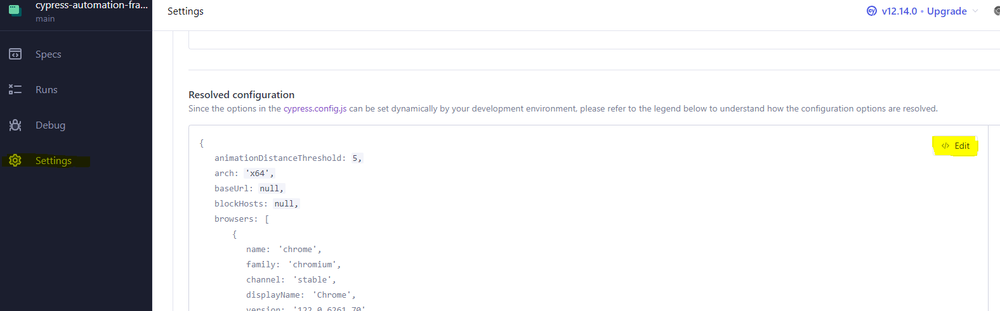<br/>
> see [cypress documentation](https://docs.cypress.io/guides/references/configuration) for more details upon configuration.

## Timeouts and Pause
### Overwrite global timeout on specific command
```
cy.visit(Cypress.env('webdriveruniversityBaseUrl', { timeout: 60000 }));
```
### Overwrite global timeout on a test
```
Describe('my test', () => {

Cypress.config('defaultCommandTimeout', 20000)

    it('do something', () => {
        //something to do
    })
})
```

### Force a pause
You can force a pause after a specific cypress command and even inside the same instruction:<br/>
```
cy.title().pause().should('include', 'something'')
```
When adding a pause inside the same isntruction, it allows to go to the next cypress command in the instruction without continuing the hole test:<br/>
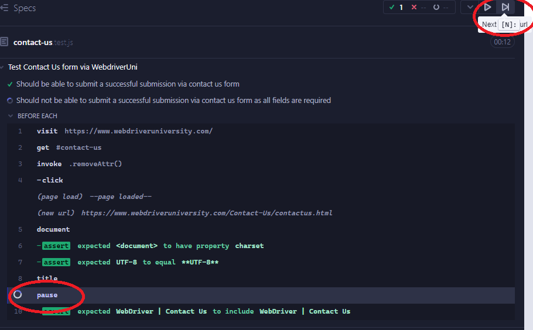

> usefull to debug a test !

### Wait
Used to wait for an actions or a certain time.
```
cy.wait(3000) // wait 3000ms
cy.wait('@getProfile') // wait for alias to be available
```
It is not recommended to add wait as it can explode the time for all the test's run.

## Debugger
As a synchronous command, it must be declared in the then() promise to ensure it applies at the expected location in the test workflow.
For instance:
```
cy.get("cssSelector").each(($el) => {
        //do something
    }).then(() => {
        debugger // will pause in the debugger dev tool once each selected elements are treated.
    })
```
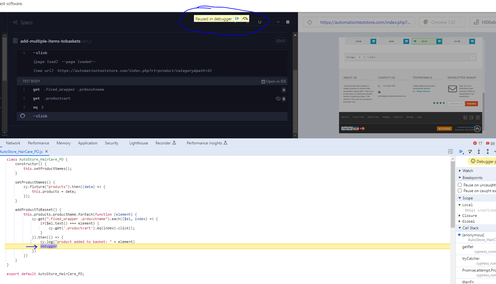

## Capturing screenshots and videos
See the configuration's details [here](https://docs.cypress.io/guides/references/configuration#Screenshots)
Videos and screenshots are made only when executing cypress with the `cypress run` command line.
The report indicate where the screenshot of the failed test is stored:<br/>
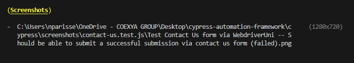

It is also possible to take a screenshot at a specific moment from cypress command:
```
cy.screenshot("screenshot title")
```
> when no title given, it is made up from `describe()` and `it()` names.
### Automatic cleareance of assets before run
Screenshots and videos folders can be removed before the run of cypress through a configuration key: `trashAssetsBeforeRuns: true`. 

## Viewport sizing
To validate multiplaform use cases, it is necessary to test different size (smartphone, tablet, surface, laptop screen, desktop screen, etc...).
Details on how to configure the `cy.viewport()`command [here](https://docs.cypress.io/api/commands/viewport#Syntax).
For instance:
```
cy.viewport(1024, 768)
cy.viewport('iphone-6')
```
> default value is 1000px width per 660px height.

The viewport size is displayed on the cypress interface:<br/>
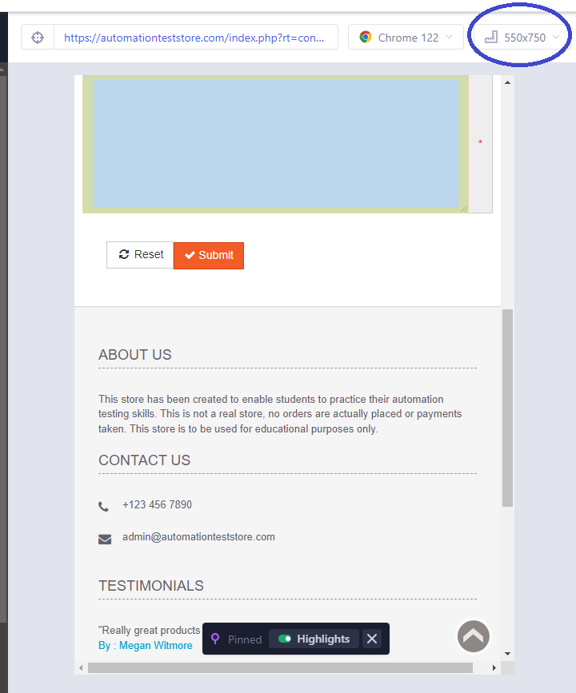

### Global initialization
In cypress.config.js:
```
e2e: {
    viewportHeight: 1080,
    viewportWidth: 1920
}
```

When the cypress interface can't display the 1:1 size it shows a zoom out snapshot of the website:<br/>
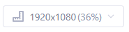

## Clear cookies/storage
Cypress clears all the cookies when it starts to run. Still, it might be requeste on a specif test amongst all the test run to clear it.
The localStorage is also cleared before each test.
more details:
- [cy.clearCookies()](https://docs.cypress.io/api/commands/clearcookies#Syntax)
- [cy.clearLocalStorage()](https://docs.cypress.io/api/commands/clearlocalstorage#Syntax)

## NPX and scripts
When running the tests, a specific test, recording on cypress cloud or jus topening cypress interface we had to apply one of the below command lines:
```
./node_modules/cypress/bin/cypress open
./node_modules/cypress/bin/cypress run --spec cypress/e2e/webdriver-uni/checkboxes.test.js
./node_modules/cypress/bin/cypress run --spec cypress/e2e/webdriver-uni/checkboxes.test.js
./node_modules/cypress/bin/cypress run --spec cypress/e2e/webdriver-uni/checkboxes.test.js --record --key
```

with npx, it just simplify them:
```
npx cypress open
npx cypress run --spec cypress/e2e/webdriver-uni/checkboxes.test.js
npx cypress run --spec cypress/e2e/webdriver-uni/checkboxes.test.js --record --key
```

### NPX install
```
npm install npx
```

### setup scripts
In package.json file, it is possible to setup scripts to apply directives such as:
```
"scripts": {
    "triggerAllTests-headless": "npx cypress run",
    "triggerAllTests-headed": "npx cypress run --headed"
  }
```

Which can then be executed by running them on npm command line:
```
npm run triggerAllTests-headless
```

## Reporting

### JUnit reporter
```
npm install --save-dev cypress-multi-reporters mocha-junit-reporter
```
for more details, see the report page on cypress [here](https://docs.cypress.io/guides/tooling/reporters#Multiple-reporters) to setup the reporte.
It will provides xml file for each test which can then be used in CI pipelines.
For instance of what these xml file can contain:
```
<?xml version="1.0" encoding="UTF-8"?>
<testsuites name="Mocha Tests" time="2.578" tests="2" failures="0">
  <testsuite name="Root Suite" timestamp="2024-03-01T16:29:11" tests="0" file="cypress\e2e\webdriver-uni\data-tables.test.js" time="0.000" failures="0">
  </testsuite>
  <testsuite name="handling data via webdriveruni" timestamp="2024-03-01T16:29:11" tests="2" time="2.563" failures="0">
    <testcase name="handling data via webdriveruni calculates and asserts the total age of all users" time="0.729" classname="calculates and asserts the total age of all users">
    </testcase>
    <testcase name="handling data via webdriveruni asserts the age of a user in the table" time="0.274" classname="asserts the age of a user in the table">
    </testcase>
  </testsuite>
</testsuites>
```

> to merge the xml files: `npx junit-merge -d cypress/results/junit -o cypress/results/junit/results.xml`

### Mochawesome
Same thing but it reports in json file and can generate automaticallly a html file from them.

To install the plugin:
```
npm install --save-dev mochawesome mochawesome-merge mochawesome-report-generator
```

reported-config.json file:
```
{
    "reporterEnabled": "spec, cypress-multi-reporters",
    "mochaJunitReporterReporterOptions": {
        "mochaFile": "cypress/results/junit/results-[hash].xml"
    },
    "reporterOptions": {
        "reporterEnabled": "mochawesome",
        "mochawesomeReporterOptions": {
            "reportDir": "cypress/results/mochawesome",
            "quite": true,
            "overwrite": false,
            "html": false,
            "json": true
        }
    }
}
```

cypress.config.js:
```
e2e: {
reporter: 'cypress-multi-reporters',
    reporterOptions: {
        configFile: 'reporter-config.json',
    }
}
```

Then executing the `npx cypress run` will also generate the json files to the directory given in *reported-config.json* file

to merge the json generated and generate the html report:
```
npx mochawesome-merge cypress/results/mochawesome/*.json > mochawesome.json && npx marge mochawesome.json
```

The html report is generated at *mochawesome-report/assets/mochawesome.html* and look like this:<br/>
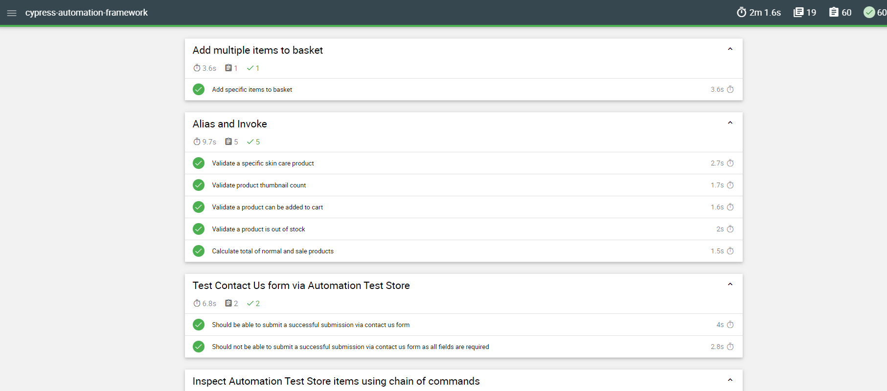

## Environment configuration file
### setup *cypress.config.js* file
```
const fs = require('fs-extra');
const path = require('path');

function getConfigurationByFile(file) {
  const pathToConfigFile = path.resolve('config', `${file}.json`)
  
  if(!fs.existsSync(pathToConfigFile)) {
    console.log('No custom config file found.' + pathToConfigFile)
    return {}
  }

  return fs.readJson(pathToConfigFile)
}

module.exports = defineConfig({
  projectId: "wztwmc",
  e2e: {
    setupNodeEvents(on, config) {
      // implement node event listeners here
      const file = config.env.configFile || ''

      return getConfigurationByFile(file)
    }
  }
})
```
> `const pathToConfigFile = path.resolve('config', `${file}.json`)` path to the config folder storing a list of config file such as:
- dev.json
- staging.json
- security.json
- prod.json

> `config.env.configFile`: key set up as argument when running cypress app.

### Setup an environment config file
For instance:
```
{
    "baseUrl": "https://www.automationteststore.com/",
    "env": {
        "name": "Joe Blogs"
    }
}
```
Any value setup in this file would overwrite the existing one setup in *cypress.config.js*

### Run cypress on specific environment
```
npx cypress open --env configFile=staging
```
The above command will look for the config/staging.json file.

### Access value from configuration file
Any custom variables must be setup in the env section of the *cypress.config.js* file.<br/>
Access the custom configuration values:
```
Cypress.env.myKey
```
> Any key setup in an environment config file such as *config/staging.json* can be retrieved through this command.