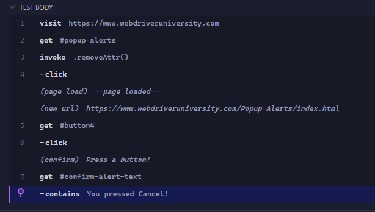
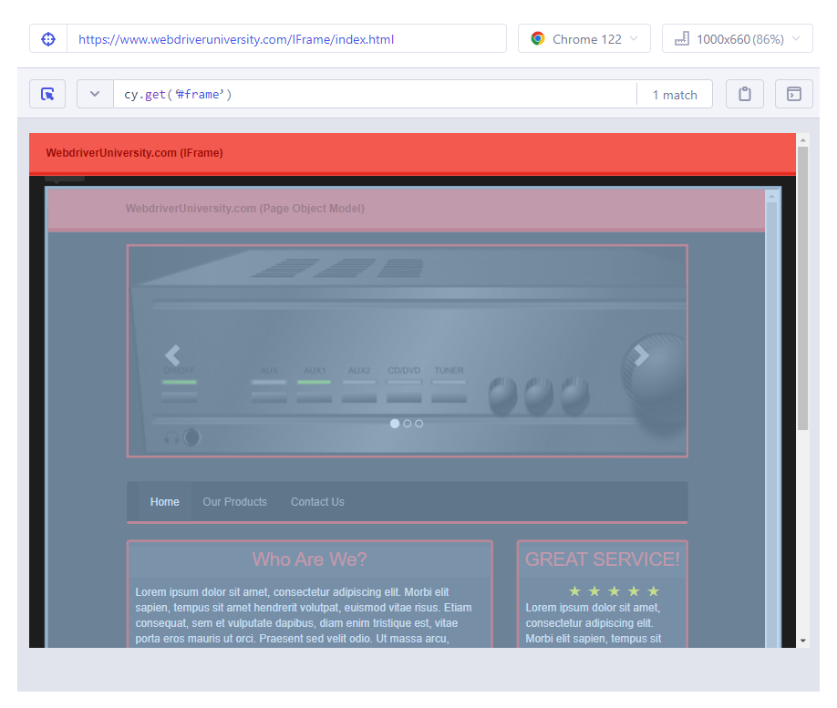
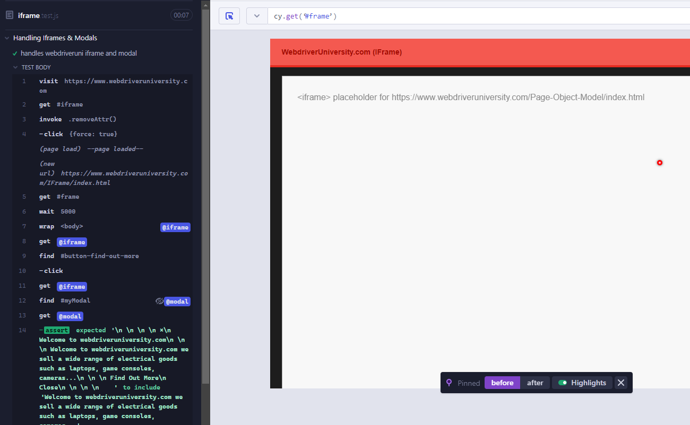

# Cypress-automation framework formation
## Prerequisite
1. Assume working on windows
2. Install [node.js](https://nodejs.org/en/download/current)
3. Install [git and git bash](https://gitforwindows.org/)
4. Install [VS code](https://code.visualstudio.com/download)
5. git, npm knowledges

## Setup dev environment
1. Create Cypress-automation-framework folder
2. Open VS code on this folder
3. Open git bash terminal on VS code<br/>
   - run `npm init`
      - follow the steps and initialize the fields as you want. For instance:<br/>
```
{
  "name": "cypress-automation-framework",
  "version": "1.0.0",
  "description": "Cypress Automation Framework",
  "main": "index.js",
  "scripts": {
    "test": "echo \"Error: no test specified\" && exit 1"
  },
  "author": "Nicolas Parisse",
  "license": "ISC"
}
```
4. Install cypress: `npm install --save-dev cypress@12.14.0`
5. Create .gitignore file and remove node_modules
6. Open cypress for the first time through git bash: `./node_modules/.bin/cypress open`
7. Select E2E Testing<br/>
8. Choose Chrome browser<br/>
9. Select Scaffold example specs<br/><br/>cypress folder must be generated in your cypress-automation-framework folder<br/>
10. Open cypress again and here are the sample tests!<br/>

## Mocha Overview

Mocha comes with two function `describe()` and `it()`. It uses those function to regroup the tests.
<br/>`describe()` takes two arguments: the name of the test and the function to apply the test. It is basically used to regroup the test.
<br/>`it()` function must define each individual test inside the describe block and also take two argument: the name of the this individual test should do and the function with all the action to perform it.

### Mocha exemple


## Usefull Extension
### ES6 Mocha Snippets
<br/>This extension will fasten your code writting with usefull autocomplete feature:<br/>

### Material Icon Theme
<br/>Just to get wonderfull icons like below:<br/>

## Web elements and selectors

### Selectors from cypress
You can get et selector directly from cypress after running a test:
1. Select a step in step body to display the iframe window you are testing
2. Click on the target icon
3. Click on the inspect icon
4. Select the expected element in the iframe window
5. Get the selector<br/>

### Selectors from chrome
Chrome dev tools has a feature in itself which propose to get css selectors of elements from the html file.
1. Open dev tools (press F12 on chrome tab)
2. Select elements tab
3. Click on the inspect icon
4. Select the expected element
5. Right-click on the expected element > copy > css selector<br/>

### Best practice
It is way recommended to create a specific attribute on the elements during the development. For instance `data-cy`. It will avoid any issue when a feature changes the css elements or its position in the html page.
You can check this [topic](https://docs.cypress.io/guides/references/best-practices#Selecting-Elements) to be convinced.<br/>

### Usefull chrome extension
[Ranorex Selocity](https://chromewebstore.google.com/detail/ranorex-selocity/ocgghcnnjekfpbmafindjmijdpopafoe) can be usefull to find the simpliest css selector. It can also be used to find element through xpath.<br/>

## Assertions

### Overview
The assertions on Cypress are handled through the chai library.<br/>
Chai has several interfaces that allow the developer to choose the most comfortable. The chain-capable BDD styles provide an expressive language & readable style, while the TDD assert style provides a more classical feel.<br/>
<br/>
You can visit the [chai website](https://www.chaijs.com/) for more details.

### Valid assertion


### Invalid assertion
In case of invalid assertion, cypress presents the reason why it did not workd and also point out specifically where the invalid assertion is located in the code.<br/>


## Execute all tests in terminal
1. Go to your git bash terminal
2. Run this command: `./node_modules/.bin/cypress run`
   - the tests start to run:<br/><br/>This window provides the configuration of the test environment such as the web browser where the tests are running, the cypress version, etc...
   - the test result for one test:<br/>
   - the tests end:<br/>
<br/><br/>The above command executes the tests headlessly, you won't see them running. You can modify this behaviour by adding the `--headed` option: `./node_modules/.bin/cypress run --headed`<br/>
All the options available are listed on cypress website documentation [here](https://docs.cypress.io/guides/guides/command-line#Options)

## Cypress Asynchronous framework

Cypress framework is asynchone. So when some script instruction are added in a test while not being from the cy framework it leads to some unexpected behaviour.
For instance in the below code:<br/>
```
describe("Test Contact Us form via Automation Test Store", () => {
    it.only("Should be able to submit a successful submission via contact us form", () => {
        cy.visit("https://automationteststore.com/"); 
        cy.xpath('//a[contains(@href, "contact") and starts-with(text(), "Con")]').click();
        cy.get('#ContactUsFrm_first_name').type("Jean");
        cy.get('#ContactUsFrm_email').type("Jean.Valjean@email.com");
        cy.get('#ContactUsFrm_email').should('have.attr', 'name', 'email')
        cy.get('#ContactUsFrm_enquiry').type("Do you provide international shipping?");
        cy.get('button[title="Submit"]').click();
        cy.get('.mb40 > :nth-child(3)').should('have.text', "Your enquiry has been successfully sent to the store owner!")
        console.log("Test has been completed!")
    })
})
```
The console.log instruction will most likely happen before all the cy instructions.

### Cypress logs
As Console.log can't be used, you must use Cypress log command:<br/>
`cy.log("Test has been completed!")`

### Promises
It is actually possible to handle non cypress command by using promises:<br/>
```
describe('Inspect Automation Test Store items using chain of commands', () => {
    it('Click on the first item using item text', () => {
        cy.visit("https://automationteststore.com/")
        cy.get('.prdocutname').contains('Skinsheen Bronzer Stick').click().then(function(itemHeaderText){
            console.log('Selected the following item: ' + itemHeaderText.text())
        })
    })
})
```
In the above code sample, the console.log command is handled correctly as it is inserted in the callback function of then method.

## Variables, commands and promises
### Bad practice
Variables should never used to perform cy commands as the order of action can't be certain. 
Instance of a bad practice:
```
const makeupLink = cy.get("a[href*='product/category&path=']").contains('Makeup')
const skincareLink = cy.get("a[href*='product/category&path=']").contains('Skincare')
skincareLink.click()
makeupLink.click()
```

### Good practice
A variable should not be used to perform cy commands, when it is used it should only to get information. It must also be used through a promise to ensure the element is still accessible.
For instance:
```
cy.get('h1 .maintext').then(($headerText) => {
            const headerText = $headerText.text()
            cy.log("Found header text: " + headerText)
            expect(headerText).is.eq('Makeup')
        })
```

## Invoke and Aliases

### Invoke
Invoke cypress method will invoke the JQuery method given as parameter:
`cy.get('.modal').invoke('show')`

### Aliases
BeforeEach function in cypress is performed before any individual test inside a describe function. In this BeforeEach function, you can define aliases which will then be accessible in each individual tests:

```
beforeEach(() => {
    cy.visit("https://automationteststore.com/")
    cy.get("a[href*='product/category&path=']").contains('Hair Care').click()
    cy.get("#grid").click()
    cy.get(".thumbnails.grid .thumbnail").as("productThumbnailGrid")
})

it('Validate product thumbnail count', () => {
    cy.get('@productThumbnailGrid').should('have.length', 4)
})
```

> Aliases are not necessarly inserted in BeforeEach function.

## Security restriction
Cypress prevent access to a page from a different domain in a single test. it is not possible to visit site of different domains.
For instance, both test codes won't work:
```
describe("Cypress web security", () => {
    it("Validate visiting two different domains", () => {
        cy.visit("https://www.webdriveruniversity.com/")
        cy.visit("https://automationteststore.com/")
    });

    it.only("validate visiting two different domains via user action", () => {
        cy.visit("https://www.webdriveruniversity.com/")
        cy.get("#automation-test-store").invoke("removeAttr", "target").click() // click on a button which redirect to https://automationteststore.com/
        cy.contains('#ContactUsFrm', 'Contact Us Form').find('#field_11').should('contain', 'First name')
    });
})
```

## Browser navigation
### Prevent multiple tabs
To prevent a button opening a new tab when clicking on it:
```cy.get("#contact-us").invoke('removeAttr', 'target').click()```

### Go back to previous
When a button direct to a new page, we might want to go back to the previous page as would do the previous button of the browser:
```cy.go('back')```
### Go forward
```cy.go('forward')```
### Reload
reload with cache: `cy.reload()`
reload without cache: `cy.reload(true)`

## Handling event
For further details upon events see the Cypress documentation is [here](https://docs.cypress.io/api/cypress-api/catalog-of-events#Event-Types).

### Js Alert box 
Cypress automatically accept alert event. It still possible to handle them.
For instance, we can assert it contains a certain string:
```
cy.on('window:alert', (str) => {
    expect(str).to.equal('I am an alert box!')
})
```

### Js Confirm box
```
it("Validate Js confirm box works when clicking cancel", () => {
    cy.visit("https://www.webdriveruniversity.com")
    cy.get("#popup-alerts").invoke('removeAttr', 'target').click()
    
    cy.get("#button4").click()

    cy.on('window:confirm', (str) => {
        return false; // Cancel the confirm box
    })

    cy.get("#confirm-alert-text").contains('You pressed Cancel!')
});
```
The Cypress log would result as below:<br/>

## How to handle iframe
By default, Cypress does not handle iframes.
For instance, you can't select any element in an iframe from Cypress window:<br/><br/>
Cypress would only provide you the access to the iframe element.

In order to bypass this, it is possible to use a promise to handle the content of the iframe, grab the body of the iframe and wrap it in the cy.wrap method to perform cy press commands on it:
```
cy.get('#frame').then($iframe => {
    const body = $iframe.contents().find('body')
    cy.wrap(body).as('iframe')
})
```
This bypass will work as Cypress will then be able to use the iframe's body as a usual html element. Still, the snapshot won't display the content of the iframe while performing action on it. So when a test fail on an iframe it can't be handled easily.
<br/>Below, the 'blank' image while the test still passed:<br/><br/>
> the issue can be found on github [here](https://github.com/cypress-io/cypress/issues/136) and seem not to be taken seriously by Cypress.

## Checkboxes and radiobutton
### Check one or first
```
cy.get('[type="checkbox"]').check() // Check checkbox element
cy.get('[type="radio"]').first().check() // Check first radio element
```
### Check multiple and specific ones from value
below checkboxes:
```
<form>
  <input type="checkbox" id="subscribe" value="subscribe" />
  <label for="subscribe">Subscribe to newsletter?</label>
  <input type="checkbox" id="acceptTerms" value="accept" />
  <label for="acceptTerms">Accept terms and conditions.</label>
</form>
```

Can be checked by value as below:
```
cy.get('form input').check(['subscribe', 'accept'])
```
### Check radiobutton is disabled
`cy.get('#radio-buttons-selected-disabled input[type="radio"][value="cabbage"]').should('be.disabled')`

